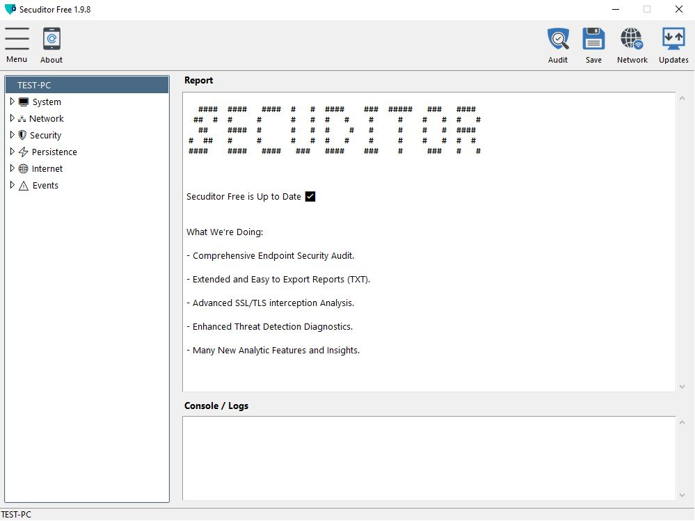

<h2 align="center">Introduction </h2>

[Secuditor Free](https://github.com/secuditor/secuditor-free) is a diagnostic and forensic security tool for Windows endpoints and private or commercial networks. 
It is safe, digitally signed and verified to ensure authenticity. 
Designed for cybersecurity operations and analytic use. Since it is primarily based on Python code, some antivirus programs may mistakenly block its operations. 
If you trust this application, you may need to create an exception, or add it to your antivirus software’s whitelist. 
Created by Menahem Levinski, a developer and verified publisher.

